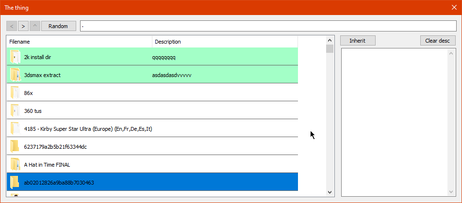

# Drive annotator

This is a program I hacked up together to assist in annotating directories.

## How to use

I didn't bother making it exactly easy to use for anybody but myself, so you'll have to rebuild using commented out code (also the drive letter is hard coded)

* Get an MFT dump in file listing csv format with [MFTECMD](https://github.com/EricZimmerman/MFTECmd)

* Use LoadFromCsv to populate the STL map and SaveMapStl to save the STL map to the bin map FINAL.bin (winmain should have commented out code for that)

* Make backups

WiztreeCsvDirList was for listing out and sorting wiztree dumps so that I could compare the data in the map.